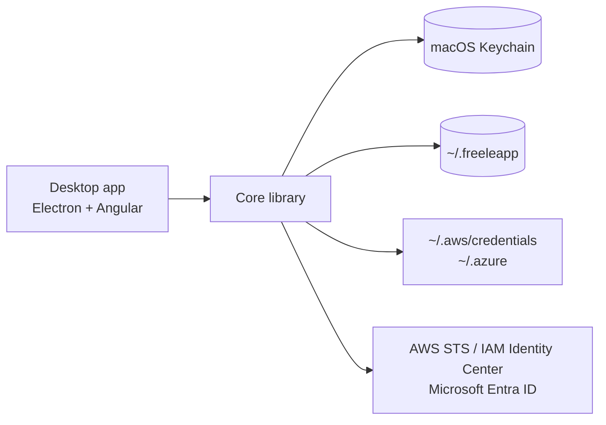

# Freeleapp

Temporary AWS and Azure credentials on your Mac, one click away. A maintained, free and open-source continuation of the [Leapp](https://github.com/Noovolari/leapp) desktop app.

## About

Leapp has had no release since v0.26.1 (June 2024), after Noovolari shut down. Freeleapp keeps the app working on current macOS versions and removes everything that depended on the discontinued company services.

Differences from upstream Leapp:

- One edition with every feature: no Pro or Team tier, no sign-in.
- No telemetry: the usage analytics client is removed.
- Updated for current macOS: new UI and icon, resizable window, AWS console multi-session instead of a browser extension.
- Update checks and release notes come from this repository's GitHub Releases.
- Your Leapp setup moves over automatically: on first launch Freeleapp copies `~/.Leapp` to `~/.freeleapp` (the original stays as a backup) and moves keychain items to the `Freeleapp` service as they are used.

Documentation: [freeleapp.com](https://freeleapp.com).

Freeleapp is not affiliated with Noovolari or beSharp. "Leapp" is a trademark of its respective owners.

## How It Works



The core library (`packages/core`) holds the session logic and the desktop app is built on top of it. Temporary credentials are written to the standard AWS and Azure CLI files, so any tool that reads them works unchanged. Long-term secrets stay in the macOS Keychain; the configuration file is encrypted.

## Stack

| Layer | Technology |
|-------|------------|
| Desktop shell | Electron |
| UI | Angular, Angular Material |
| Core library | TypeScript, AWS SDK v3, MSAL |
| Secrets | macOS Keychain (keytar) |
| Packaging | electron-builder, GitHub Actions (macOS arm64) |

## Install

Download the `.dmg` from [Releases](https://github.com/sergioarojasm98/freeleapp/releases) (Apple Silicon). Builds are ad-hoc signed until notarization is set up, so clear the quarantine flag after copying the app:

```bash
xattr -dr com.apple.quarantine /Applications/Freeleapp.app
```

A Homebrew tap is planned.

## Build

```bash
nvm use                      # Node version from .nvmrc
npm install
cd packages/core && npm install && npm run build
cd ../desktop-app && npm install
npx gushio gushio/target-build.js 'configuration production'
npx electron-builder build --mac dir --arm64 --publish never
```

Tests: `npx jest` in `packages/core`, and `npm test -- --watch=false --browsers=ChromeHeadless` in `packages/desktop-app`.

## License

[Mozilla Public License 2.0](LICENSE), same as upstream. Original work © Noovolari and the Leapp contributors.
