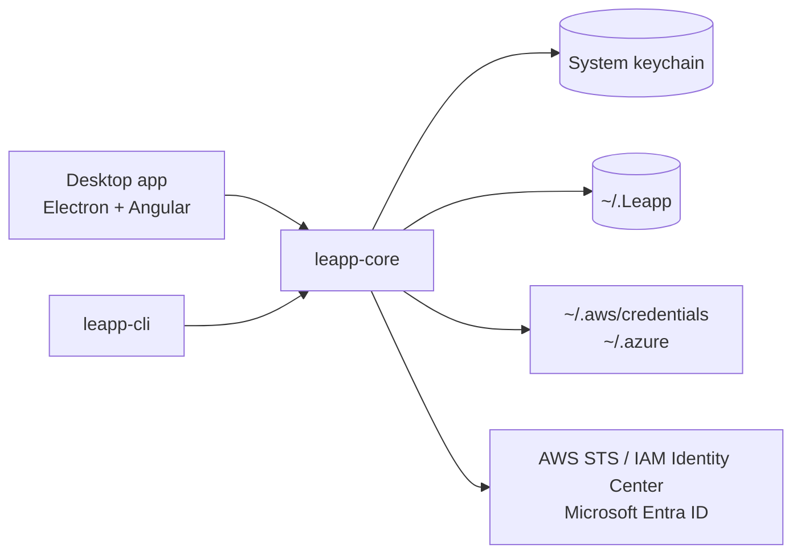

# Freeleapp

A maintained community fork of [Leapp](https://github.com/Noovolari/leapp), the desktop app that manages temporary cloud credentials for AWS and Azure.

## About

Leapp has had no release since v0.26.1 (June 2024), after Noovolari shut down. Freeleapp keeps the app working on current macOS versions and removes everything that depended on the discontinued company services.

Differences from upstream Leapp:

- No telemetry: the PostHog analytics client is removed.
- No Leapp Pro or Team: the sign-in, plans and workspace sync screens are removed; everything runs on the local workspace.
- Update checks and release notes come from this repository's GitHub Releases.
- Data stays compatible: sessions live in `~/.Leapp` and the system keychain under the same keys as Leapp, so an existing setup carries over, and the IPC channel `leapp-cli` uses is unchanged.

Freeleapp is not affiliated with Noovolari or beSharp. "Leapp" is a trademark of its respective owners.

## How It Works



`leapp-core` holds the session logic; the desktop app and the CLI are clients on top of it. Temporary credentials are written to the standard AWS and Azure CLI files, so any tool that reads them works unchanged.

## Stack

| Layer | Technology |
|-------|------------|
| Desktop shell | Electron |
| UI | Angular, Angular Material |
| Core library | TypeScript, AWS SDK v3, MSAL |
| Secrets | macOS Keychain / Windows Credential Manager / libsecret (keytar) |
| Packaging | electron-builder, GitHub Actions (macOS arm64) |

## Install

Download the `.dmg` from [Releases](https://github.com/sergioarojasm98/freeleapp/releases) (Apple Silicon). Builds are ad-hoc signed until notarization is set up, so clear the quarantine flag after copying the app:

```bash
xattr -dr com.apple.quarantine /Applications/Freeleapp.app
```

A Homebrew tap is planned.

## Build

```bash
nvm use                      # Node version from .nvmrc
npm install
cd packages/core && npm install && npm run build
cd ../desktop-app && npm install
npx gushio gushio/target-build.js 'configuration production'
npx electron-builder build --mac dir --arm64 --publish never
```

Tests: `npx jest` in `packages/core`, and `npx ng test --watch=false --browsers=ChromeHeadless` in `packages/desktop-app`.

## License

[Mozilla Public License 2.0](LICENSE), same as upstream. Original work © Noovolari and the Leapp contributors.
